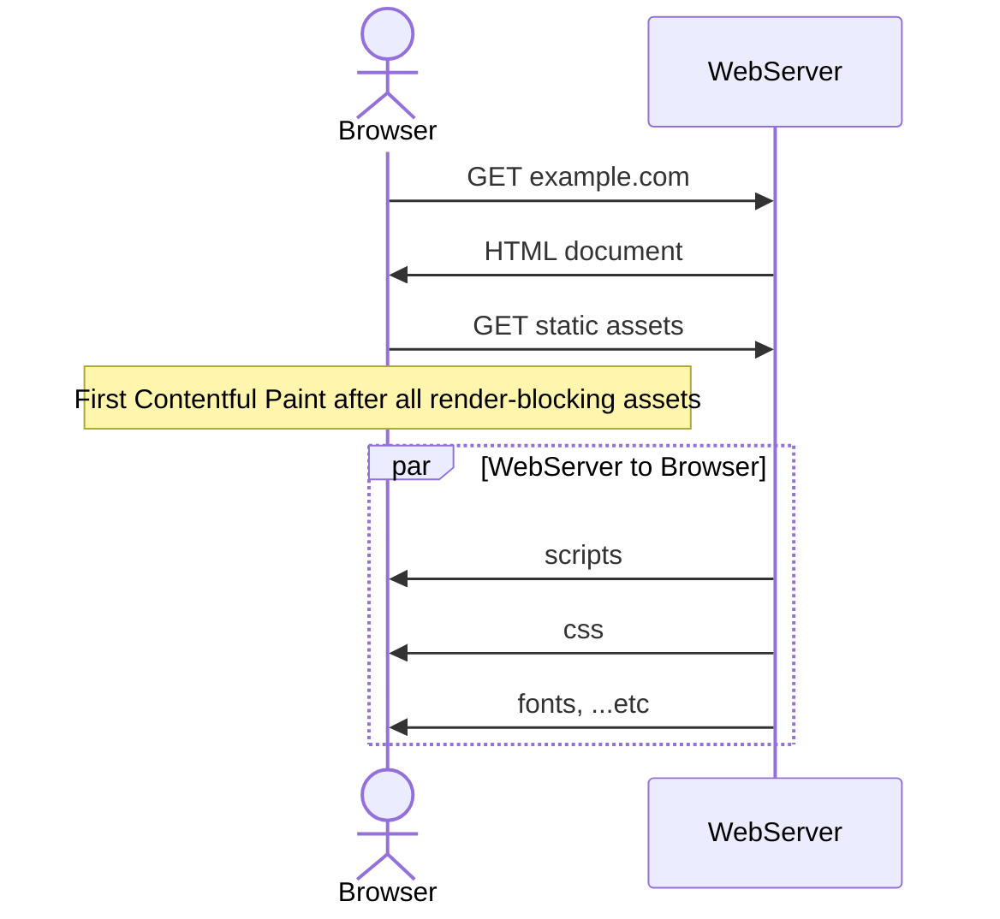
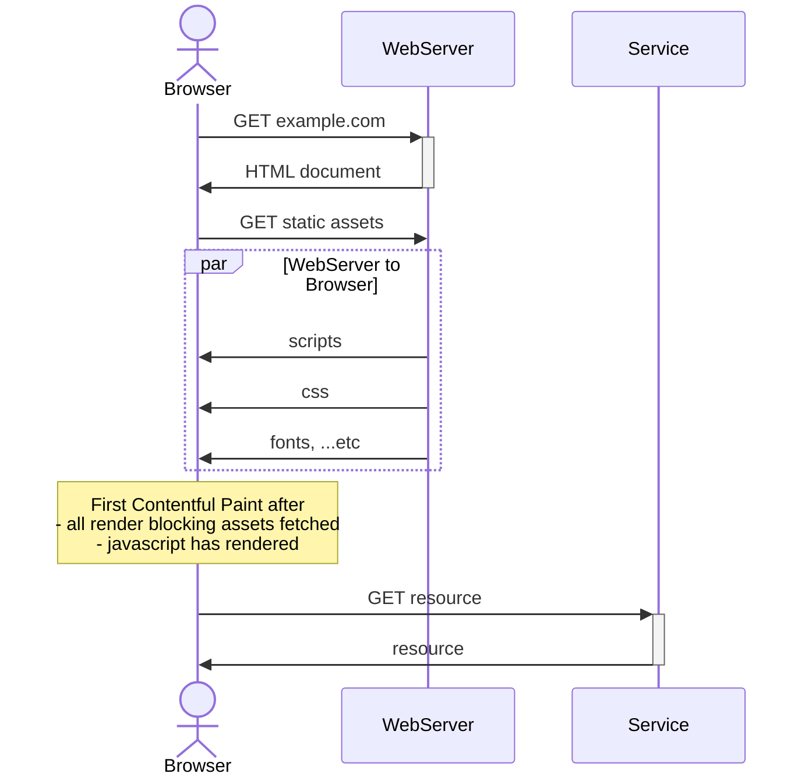
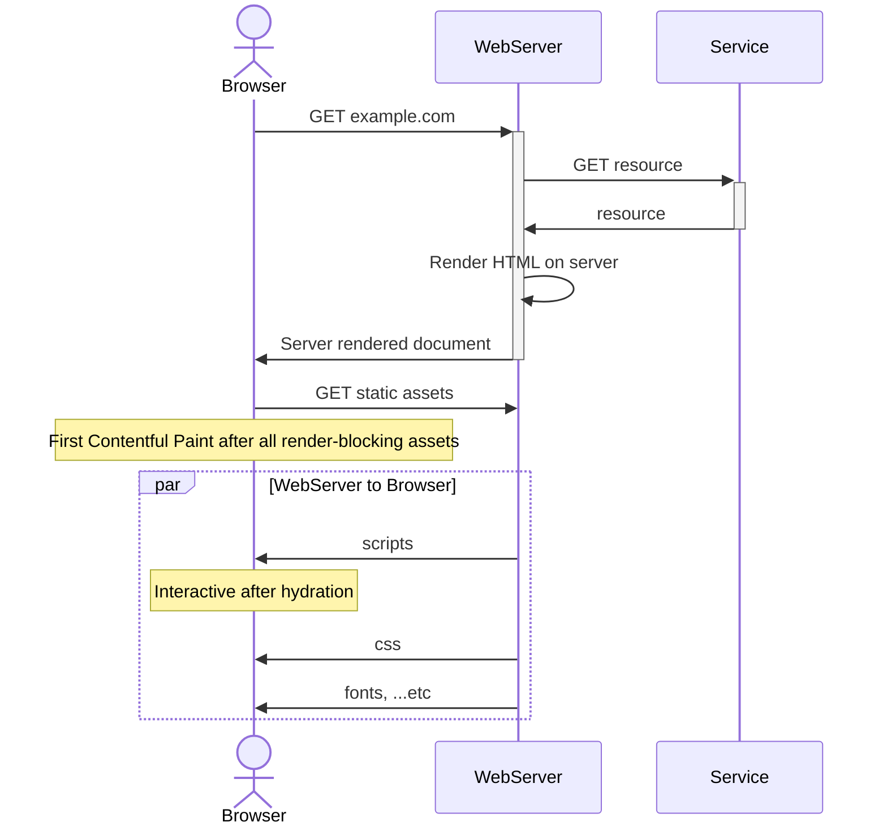
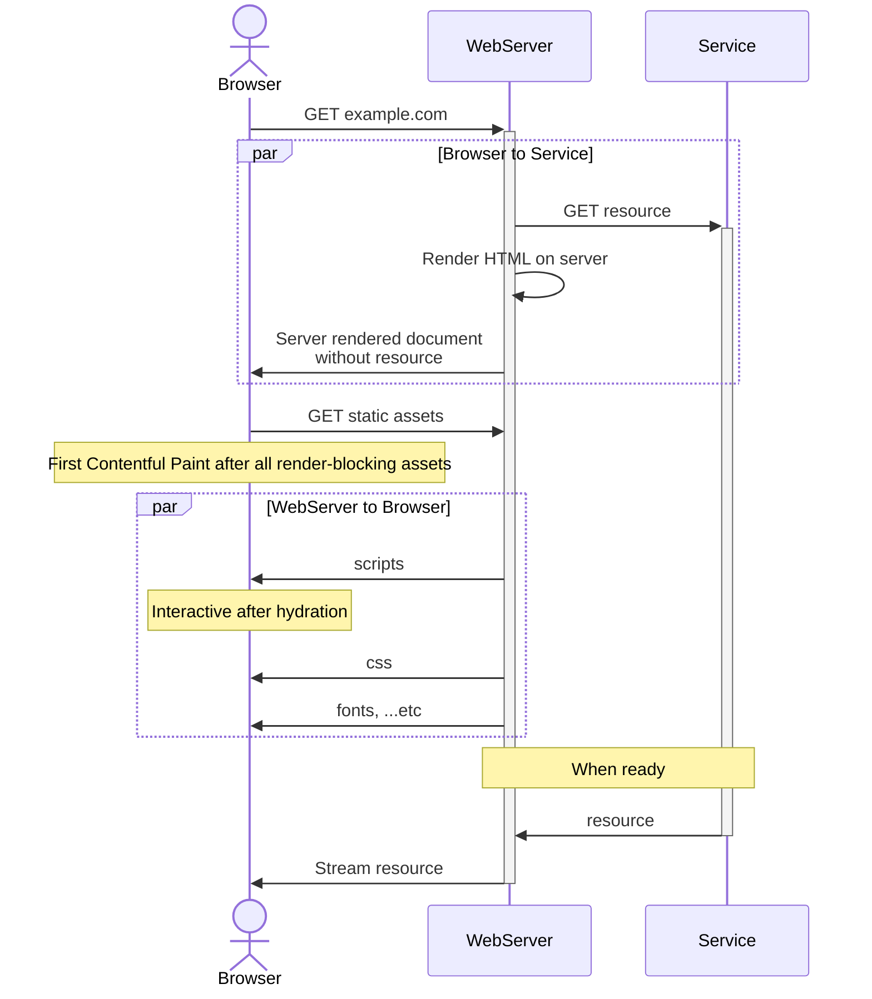

# Paradigms on the frontend

> This article is meant for a wide audience.
> If you're a frontend developer you should know most of the content here, skip ahead to the sections you're curious in.

It has been a number of years since the boom of frameworks like React, Vue, Angular, ...etc.  
In the last couple of years, you may have also seen new frameworks like Qwik & Astro rising in popularity.
Specifically in React, you may also have heard of React Server Components.

Is there a new paradigm shift?
Are these new ideas an improvement over what existing frameworks, or are they solving a different problem?

## Metrics

Before we get into the thick of it, let's review some metrics one might use.

### Performance (Lighthouse)

[Google's Lighthouse](https://developer.chrome.com/docs/lighthouse/overview/) has 5 different audits.
The Performance audit has the most relevance so we'll keep it simple and look into that.  
These are the 5 metrics of Performance audit in Lighthouse 10:

| Metric                           | Description                                                                                                                                 |
| -------------------------------- | ------------------------------------------------------------------------------------------------------------------------------------------- |
| **First Contentful Paint (FCP)** | Measures the time from page load to any content rendering. Users should see anything as soon as possible to reassure something is happening |
| **Total Blocking Time (TBT)**    | Measures the time between FCP and time to interactivity                                                                                     |
| Speed Index (SI)                 | Measures how quickly the contents are populated                                                                                             |
| Largest Contentful Paint (LCP)   | Measures the render time of the largest text block or image visible within the viewport, relative to when the page first started loading    |
| Cumulative Layout Shift (CLS)    | Measures unexpected layout shifts in the page                                                                                               |

While this article isn't focused on the numbers and all technical details, I think it helps to have a picture of the metrics that our industry use.
I did not use Lighthouse to measure my demos in this repo because the demos are all slightly different; it wouldn't be fair.

TL;DR We want our users to have a responsive experience, as soon as possible.
FCP and TBT will be the core metrics for this article.

### Interactivity

What is the cost in complexity for interactivity?

For example, we might want native app-like experiences where users can interact with graphs, go through a form wizard, have smooth transitions between pages, ...etc.

## Approaches

1. Static site
1. Static site generation (SSG)
1. Client side rendering (CSR)
1. Server side rendering (SSR)
1. Server side rendering w/ streams
1. Partial hydration & Islands
1. Phoenix LiveView

> ### Disclaimer
>
> All paradigms have _some ways_ to circumvent their weaknesses
> I am deliberately pointing these weaknesses out but I might not cover all possible workarounds

```sh
pnpm i
pnpm dev
```

## 1. Static sites

### Use case

This is how it all began: there is little to no interactivity in the very early days of websites, and the content served are mostly static.
Without involving Javascript, you'd use `<a>` anchor links to move from page to page, and `<form action="/action" method="post">` to interact with services.

These days, modern static sites typically have some interactivity, by making use of Javascript alongside modern frameworks.

### Demo

Visit http://localhost:3001 for the demo.

In this demo, I used the package [`serve-handler`](https://github.com/vercel/serve-handler) to _serve_ static files.
While the differences in features and performance can be stark, you can think of this as serving content from an `nginx` server.
To have a better sense of what is happening, I deliberately added a delay to responses.

### What is happening?



After the browser retrieves the document, it parses through it for any assets it needs to fetch, then fetch it. This sequencial call is inevitable, and there are [certain assets](https://developer.chrome.com/docs/lighthouse/performance/render-blocking-resources) that are render-blocking. When all of these assets are retrieved, the browser will then paint the content on the screen.[^1]

### Reviewing metrics

#### Performance

FCP ✅

- This is about as vanilla as it gets; there is a bare minimum of network requests
- Our content is in the HTML, so the user sees the content immediately

TBT ✅

- If no javascript code is shipped, then there is 0 blocking time for the user
- Otherwise, the only bottleneck is your code

For all intents and purposes, this approach is the gold standard for performance.

#### Complexity

On the side of complexity, it can be difficult to manage a static site that grows if you engineer your own solution. Fortunately, nobody writes their own solution today; we'll address in the next section.

### Avenues of improving performance (out of scope)

- Deploy your site to a CDN[^2]
- Optimize which asset to be fetched first
  - Defer non-critical assets
  - Lazy load assets/content
- Optimize your assets
  - Minify scripts, CSS
  - Inline your critical CSS in the document (extreme?)
- Use a service worker to:
  - Cache your assets
  - Have your content available offline

## 2. Static site generation (SSG)

Static site generators should need no introduction, this domain is extremely saturated. In short, they process some files in a given syntax (e.g. markdown) and create a static site. Some languages other than Javascript may also have a framework, some popular ones are:

- Gatsby (React)
- Astro (React/Vue/Svelte/Lit ...etc)
- Docusaurus (React)
- Hugo (Go)
- Jekyll (Ruby)
- NextJs (React)
- Nuxt (Vue)

### Use case

> Note that most of these have something that sets them apart.  
> For example, NextJs and Nuxt are included here but they're more of a swiss army knife.
> Docusaurus excels in writing documentations and helps you: maintain versions, support multiple languages, search content.
> Astro excels in allowing developers writing interactivity while keeping the site performant. More on how this works in the [Partial Hydration](#partial-hydration--islands) section
> **The intent here is not to cover all the quirks and features of these frameworks, so we'll only discuss their base feature: SSG.**

For SSG, the general use case is when your content has little interactivity and is mostly static.

### Demo

Visit http://localhost:3002/content/1 for the demo.

Writing your docs/content and having it compile into a static site is probably what most of us have done before.
This demo features dynamic content by using a feature in NextJs to fire an API during build time to create all the pages available _at the time_.
If you read the [source code](./demos/2static-generator/src/pages/content/[id].tsx), you'll find that this is the only file we wrote.

If you were to run `pnpm turbo run build --filter=2static-generator`, you will find all possible pages pre-rendered in `demos\2static-generator\.next\server\pages\content`.

> Some frameworks like [NextJs](https://nextjs.org/docs/pages/building-your-application/data-fetching/incremental-static-regeneration#self-hosting-isr) and [Gatsby](https://www.gatsbyjs.com/docs/how-to/rendering-options/using-deferred-static-generation/) also has support for "incrementally generating static content"  
> The difference being static pages are created on request and cached. This can be useful for news websites where there are a lot of static content and not much need for interactivity.

## Client side rendering (SPA)

As the web continued growing in popularity, the industry realized that browsers have the highest interoperability.
It can be served on all devices and operating systems, so creating a web application will serve all potential platforms.

This was the first big paradigm shift into web apps and jQuery paved the way in interactivity for a long time.
I don't have the experience to share how it was when jQuery was popular, so we'll move along to the time when React/Vue/Angular took over.
The biggest challenge back then for writing web apps is Reactivity. We want the UI to reflect the state of our variables, but there is a lot of boiler-plate code to make this happen.

React and Vue took the Virtual DOM (VDOM) approach. This is a relatively low level detail to understand, but it will be necessary to help you understand how Hydration works in the next section.

### Use case

### What is happening?

For the page to be considered ready, the user has to wait for:

- The static files to be fetched from a web server (Nginx in this example)
- On receiving the static files, the javascript needs to render the page
- The rendered content does an API call to fetch the resource
- The resource is rendered



## Server side rendering



<!--
 -->

## Server side rendering w/ streams



<!--
 -->

## Partial hydration & Islands

Thus far, we've been shipping javascript for everything (on the page?).

What if we don't need to do that? There exist components that aren't interactive and the client doesn't need the javascript used to render it

- e.g. Header/footer
- Static content

<!--
The naming convention is pretty confusing.. at least it is to me

React calls it React server components -- it sounds like it has to be a server thing
Partial hydration also kinda implies it is a server thing

but it doesn't have to be.

our SPA can:
- lazily hydrate components only when it is visible or interacted upon
- have components be "pre-rendered" if it doesn't have any interactivity


 -->

https://www.youtube.com/watch?v=CyTHEh2yyr8&t=2s
https://github.com/bholmesdev/eleventy-vite-jam-sandwich

[^1]: https://developer.mozilla.org/en-US/docs/Web/Performance/Critical_rendering_path
[^2]: https://www.cloudflare.com/en-gb/learning/cdn/what-is-a-cdn/
