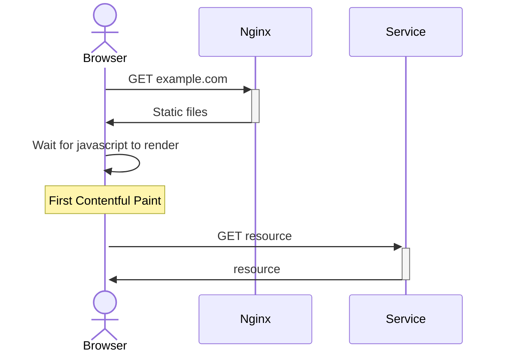
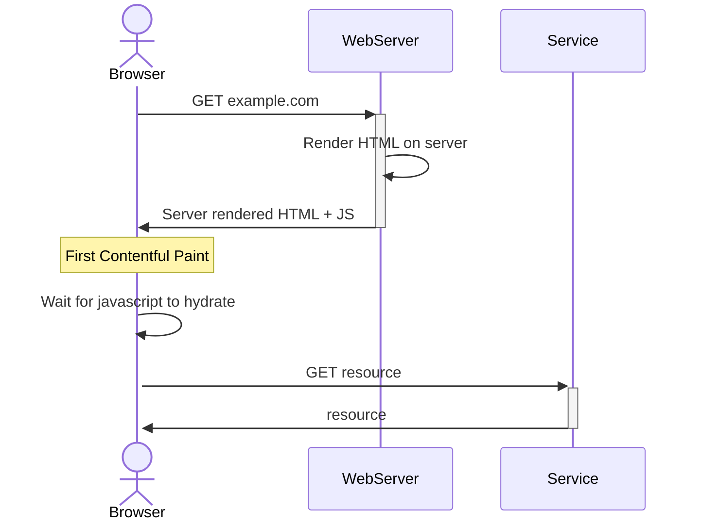
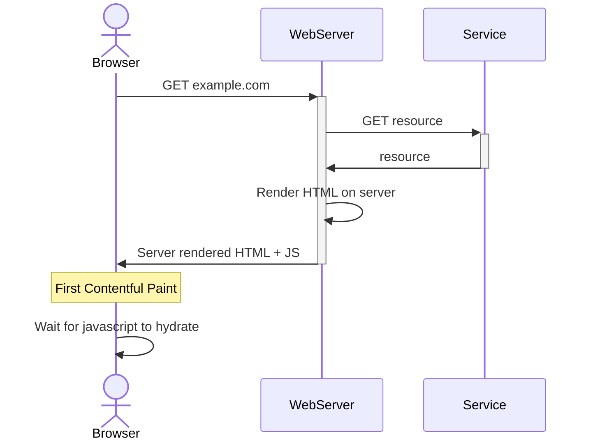

# Partial Hydration

In the last couple years there has been more focus given to server-side rendering.  
You may have heard of **Partial Hydration** or **Islands**. (in React's context, **React Server Components**).

What are they and how does it compare to what is commonly used?

In this repo, we mainly use React and we'll incrementally change our setup:

1. Client side rendering
2. Server side rendering (traditional)
3. Server side rendering with streams
4. Server side rendering with partial hydration

To round it off, we'll also use Elixir Phoenix for an "out of javascript" comparison

> **Static site generators are not in scope**
>
> These are pretty straight forward to understand, they process some files in a given syntax and create a static site.  
> Their underlying tech may already use partial hydration, however.  
> For example, these are some popular solutions:
>
> - Hugo (Go)
> - Gatsby (React)
> - Jekyll (Ruby)
> - Astro (React/Vue/Svelte/Lit ...etc)
> - Docusaurus (React)

## Metrics

What is the industry trying to do? Why should we care about this? For us to get a better idea, let's use some metrics.

### Lighthouse

[Google's Lighthouse](https://developer.chrome.com/docs/lighthouse/overview/) has 5 different audits.
The Performance audit has the most relevance so we'll keep it simple and use that.

These are the 5 metrics of Performance audit in Lighthouse 10:

- **First Contentful Paint (FCP)**
  - Measures the time from page load to any content rendering
  - Users should see anything as soon as possible to reassure something is happening
- **Speed Index (SI)**
  - Measures how quickly the contents are populated
- **Largest Contentful Paint (LCP)**
  - Measures the render time of the largest text block or image visible within the viewport, relative to when the page first started loading
- **Total Blocking Time (TBT)**
  - Measures the time between FCP and time to interactivity
- **Cumulative Layout Shift (CLS)**
  - Measures unexpected layout shifts in the page

**TL;DR: We want our users to have a responsive experience, as soon as possible**

### Complexity

While trying to make these improvements, what are we sacrificing?

---

## Client side rendering

_(or sometimes referred to as Single Page Application)_

### Sequence of events

For the page to be considered ready, the user has to wait for:

- The static files to be fetched from a web server (Nginx in this example)
- On receiving the static files, the javascript needs to render the page
- The rendered content does an API call to fetch the resource
- The resource is rendered

### Pros/cons

Pros:

- Low complexity
  - There is no routing involved on the server, you always serve the same static files
  -

Cons:

- Bundle size can be huge if the app is not code-split
- Round trips for API calls
- APIs are publicly exposed
- Javascript required
  - App doesn't render until all the javascript arrives
  - Tend to be less bot/crawler friendly

<!-- DEMO:
- Slow network = need to wait for full bundle
- Slow PC = need to wait for javascript to render
- Slow network = need to wait for API calls
-->

With code splitting

- Lesser bundle size than SPA, still easy to reason about for devs
- .. but slight overhead of cleanly code-splitting your app

## Server side rendering

<!--
to reference
 https://reactrouter.com/en/main/guides/ssr -->

### Sequence of events (without server retrieving initial data)

### Sequence of events (with initial data)

<!-- this is not always possible, because web apps typically interact with a service past the first load -->

### Pros/cons

Pros:

- API calls are made on server side, which should have lower latency
- Naturally code split(?), only what is required is served
-

Cons:

- Every page can be a round trip to the server (not in scope?: frameworks that skip this)

<!-- DEMO:
- HTML is available _before_ hydration (i.e. before javascript is loaded)
- Slow PC = need to wait for javascript to render
- Slow network = need to wait for API calls
-->

## Partial hydration

Astro popularized this with the term "Islands", but the outcome is similar. _(the approach is also known as React Server Components in React)_

<!--
https://www.gatsbyjs.com/docs/conceptual/partial-hydration
-->

## References or useful links

- [Astro on Islands](https://docs.astro.build/en/concepts/islands/)
- [Gatsby on Partial Hydration](https://www.gatsbyjs.com/docs/conceptual/partial-hydration/)
- Window approach inspired by react-query's [SSR page](https://tanstack.com/query/v4/docs/react/guides/ssr)
- Data fetching suspense [Codesandbox on react's docs page](https://react.dev/reference/react/Suspense#usage)
