# Paradigms on the frontend

> This article is meant for a wide audience  
> If you're a frontend developer you should know most of the content here. Skip ahead to the sections you're curious in

It has been a number of years since the boom of frameworks like React, Vue, Angular, ...etc.  
In the last couple of years, you may have also seen new frameworks like Qwik & Astro rising in popularity.
Specifically in React, you may also have heard of React Server Components.

Is there a new paradigm shift?
Are these new ideas an improvement over what existing frameworks, or are they solving a different problem?

## Metrics

Before we get into the thick of it, let's review some metrics one might use.

### Performance (Lighthouse)

[Google's Lighthouse](https://developer.chrome.com/docs/lighthouse/overview/) has 5 different audits.
The Performance audit has the most relevance so we'll keep it simple and look into that.  
These are the 5 metrics of Performance audit in Lighthouse 10:

- **First Contentful Paint (FCP)\***
  - Measures the time from page load to any content rendering
  - Users should see anything as soon as possible to reassure something is happening
- **Total Blocking Time (TBT)\***
  - Measures the time between FCP and time to interactivity
- **Speed Index (SI)**
  - Measures how quickly the contents are populated
- **Largest Contentful Paint (LCP)**
  - Measures the render time of the largest text block or image visible within the viewport, relative to when the page first started loading
- **Cumulative Layout Shift (CLS)**
  - Measures unexpected layout shifts in the page

While this article isn't focused on the numbers and all technical details, I think it helps to have a picture of the metrics that our industry use.
I did not use Lighthouse to measure my demos in this repo because the demos are all slightly different; it wouldn't be fair.

TL;DR We want our users to have a responsive experience, as soon as possible.
FCP and TBT will be the core metrics for this article.

### Implementation complexity

There isn't a good way to measure this, but this is not a trivial issue to brush aside.
We want our solution to fit our use cases and not over-engineer it.
At the same time,
As we go through each paradigm, you should be able to have a sense of how complex each of them can get.

#### Interactivity & state

If we need it, how easy is it for us to introduce "app-like" interactivity?

For example, we might want smooth transitions

#### Out-of-scope topics

Some topics that we will need to think about:

- Routing
- Pushing to edge/cdn
- Fault tolerance

## Approaches

1. Static site
1. Static site generation (SSG)
1. Client side rendering (CSR)
1. Server side rendering (SSR)
1. Server side rendering w/ streams
1. Partial hydration & Islands
1. Phoenix LiveView

> ### Disclaimer
>
> All paradigms have _some ways_ to circumvent their weaknesses
> I am deliberately pointing these weaknesses out but I might not cover all possible workarounds

```sh
pnpm i
pnpm dev
```

## Static sites

### Use case

This is how it all began: there is little to no interactivity in the very early days of websites, and the content served are mostly static.
Without involving Javascript, you'd use `<a>` anchor links to move from page to page, and `<form action="/action" method="post">` to interact with services.

These days, modern static sites typically have some interactivity, by making use of Javascript alongside modern frameworks.

### Demo

Visit http://localhost:3001 for the demo.

In this demo, I used the package [`serve-handler`](https://github.com/vercel/serve-handler) to _serve_ static files.
While the differences in features and performance can be stark, you can think of this as serving content from an `nginx` server.
To have a better sense of what is happening, I deliberately added a delay to responses.

### What is happening?

```mermaid
sequenceDiagram
    actor Browser
    Browser->>WebServer: GET example.com
    WebServer->>Browser: HTML document
    Browser->>WebServer: GET static assets
    par WebServer to Browser
      WebServer->>Browser: scripts
      WebServer->>Browser: css
      WebServer->>Browser: fonts, ...etc
    end
    Note over Browser: wait for all render-blocking assets
    rect rgb(0, 0, 0)
    Note over Browser: First render!
    end
```



After the browser retrieves the document, it parses through it for any assets it needs to fetch, then fetch it. This sequencial call is inevitable, and there are [certain assets](https://developer.chrome.com/docs/lighthouse/performance/render-blocking-resources) that are render-blocking. When all of these assets are retrieved, the browser will then paint the content on the screen.[^1]

### Reviewing metrics

#### Performance

FCP ✅

- This is about as vanilla as it gets; there is a bare minimum of network requests
- Our content is in the HTML, so the user sees the content immediately

TBT ✅

- If no javascript code is shipped, then there is 0 blocking time for the user
- Otherwise, the only bottleneck is your code

For all intents and purposes, this approach is the gold standard for performance.

#### Complexity

On the side of complexity, it can be difficult to manage a static site that grows if you engineer your own solution. Fortunately, nobody writes their own solution today; we'll address in the next section.

### Avenues of improving performance (out of scope)

- Deploy your site to a CDN[^2]
- Optimize which asset to be fetched first
  - Defer non-critical assets
  - Lazy load assets/content
- Optimize your assets
  - Minify scripts, CSS
  - Inline your critical CSS in the document (extreme?)
- Use a service worker to:
  - Cache your assets
  - Have your content available offline

## Static site generation

Static site generators should need no introduction, this domain is extremely saturated. They process some files in a given syntax and create a static site. Some languages other than Javascript may also have a framework, some popular ones are:

- NextJs (React)
- Nuxt (Vue)
- Gatsby (React)
- Astro (React/Vue/Svelte/Lit ...etc)
- Docusaurus (React)
- Hugo (Go)
- Jekyll (Ruby)

### Use case

You should almost always use an existing framework instead of engineering your own. With each framework competing with each other in performance or developer experience, it

### Demo

https://www.gatsbyjs.com/docs/how-to/rendering-options/using-deferred-static-generation/

https://nextjs.org/docs/pages/building-your-application/data-fetching/incremental-static-regeneration#self-hosting-isr

## Dynamic content

[^1]: https://developer.mozilla.org/en-US/docs/Web/Performance/Critical_rendering_path
[^2]: https://www.cloudflare.com/en-gb/learning/cdn/what-is-a-cdn/

### Client side rendering (SPA)

<!--
 -->

### Server side rendering

<!--
 -->

### Server side rendering w/ streams

<!--
 -->

### Partial hydration & Islands

Thus far, we've been shipping javascript for everything (on the page?).

What if we don't need to do that? There exist components that aren't interactive and the client doesn't need the javascript used to render it

- e.g. Header/footer
- Static content

<!--
The naming convention is pretty confusing.. at least it is to me

React calls it React server components -- it sounds like it has to be a server thing
Partial hydration also kinda implies it is a server thing

but it doesn't have to be.

our SPA can:
- lazily hydrate components only when it is visible or interacted upon
- have components be "pre-rendered" if it doesn't have any interactivity


 -->

https://www.youtube.com/watch?v=CyTHEh2yyr8&t=2s
https://github.com/bholmesdev/eleventy-vite-jam-sandwich

Demo idea

<h1> header </h1>

<ul>
  <li>content</li>
  <li>from</li>
  <li>an</li>
  <li>api</li>
</ul>

<div> footer </div>

1. Static sites -- content can be written in files directly
1. Static site generation -- content can be written in files directly, but easier with generators (e.g. fetched at build time)
1. Incremental static site generation -- content can be fetched at run time incrementally

--

1. Client side rendering (SPA) -- content can be fetched in a waterfall
1. Server side rendering -- content can be fetched server side (the page may not load until the server has completed its fetch\*??)
1. Server side rendering w/ streams -- content can be streamed in (header and footer should render even while the content is fetching)
1. Partial hydration & Islands -- header and footer doesn't need to have their javascript sent to the client
1. Phoenix LiveView
